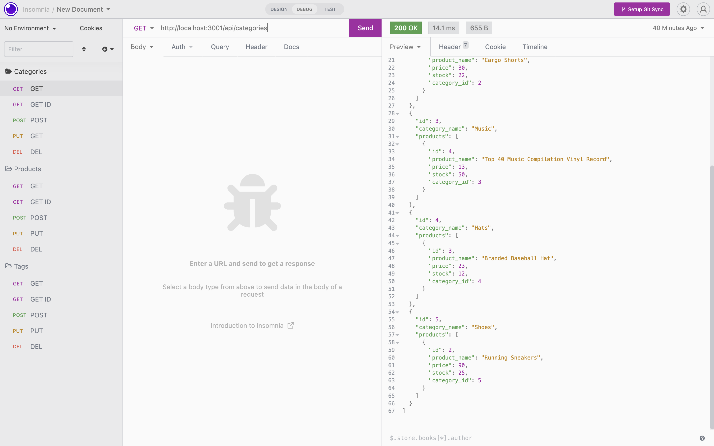
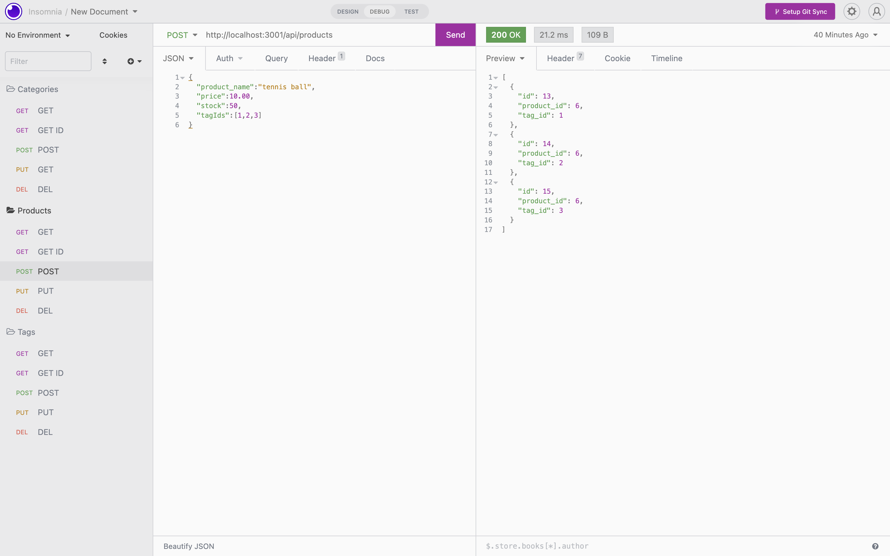

# 13 Object-Relational Mapping (ORM): E-Commerce Back End

## Description

Build the back end for an e-commerce site by modifying starter code. I configured a working Express.js API to use Sequelize to interact with a MySQL database.

I use the [MySQL2](https://www.npmjs.com/package/mysql2) and [Sequelize](https://www.npmjs.com/package/sequelize) packages to connect your Express.js API to a MySQL database and the [dotenv](https://www.npmjs.com/package/dotenv) package to use environment variables to store sensitive data.

## Mock-Up

The following images shows the application's GET and POST routes being tested in Insomnia:

### Walkthrough Video:

 To see the video [click here](https://drive.google.com/file/d/1KhNkuJzXHh89IuPNzIuHcJ64J8k7rjKG/view)
